# Australia

## Queensland (QLD)

- Tropical vegetation + wide open roads probably means you're in Queensland, drier = more inland and vice versa. Far North Queensland (Cairns area) is **very** tropical (palm trees + dark green vegetation + mountains). Sugarcane plantations are also good North Queensland signal (Townsville - Mackay corridor).
- Utility poles are usually green, with a blue sticker. Electricity poles have black markings with white numbers on the diagonal.
  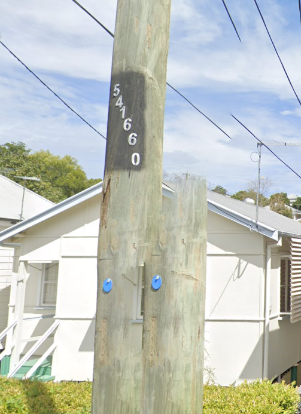{.img-size}
- If you see a school with `... State School` or `... State High School`, then you're in Queensland.
- Buses are the main public transport in Brisbane/SEQ area. They're yellow, and sometimes can find them in white/green liveries as well.
  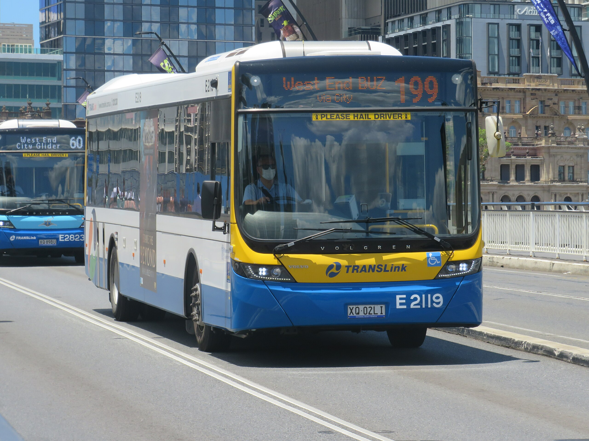{.img-size}
- Black and yellow bollards
  {.img-size}
- Any ad/poster for beer brand `XXXX` should be insta send for QLD. Some states have their own iconic breweries as well, but they're not as statewide to put here. The only exceptions I can think of are `Victorian Bitter (VB)` or `Carlton Draught` for VIC.

## New South Wales (NSW)

- Yellow number plates are exclusively NSW. While you might see NSW-registered cars in other states as well, and the state does have multiple number plate designs, if you see multiple yellow plates, then there's a very high chance you're in NSW.
  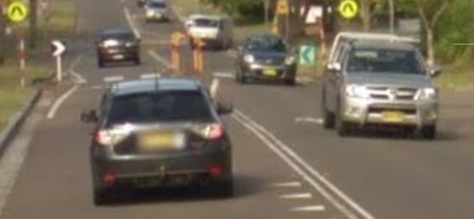{.img-size}
- Vast majority of buses in NSW are light blue.
- Red background `No Stopping` sign
  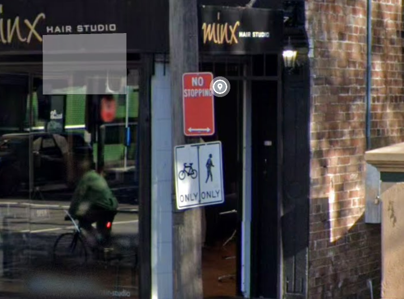{.img-size}

## Victoria (VIC)

- Utility poles in Melbourne feature white rectangular stickers with smaller blue square inside it.
  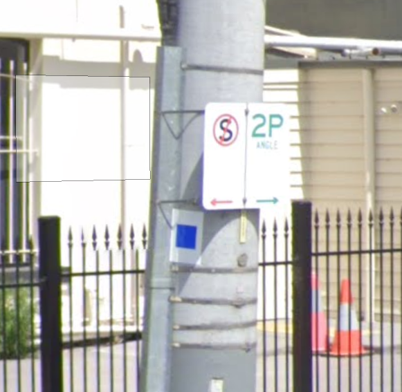{.img-size}
- Poletop.
  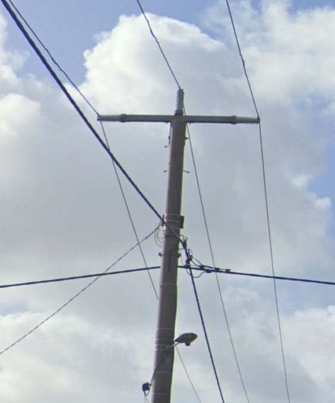{.img-size}
- This fire hydrant
  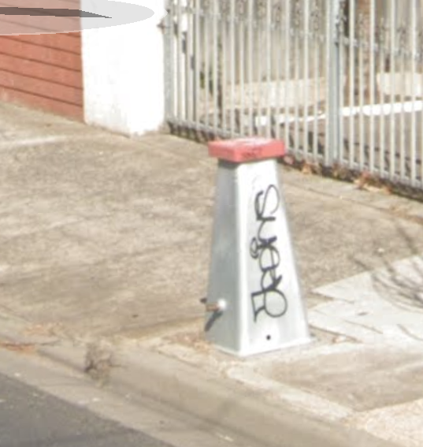{.img-size}

## Northern Territory (NT)

- Northern Territory uses rusty holey poles.
  {.img-size}
- Usually the vegetation looks a lot more tropical (rich green grass and trees) AND redder soil the closer it is to Darwin.
- The area around Alice Springs features sunny coverage, bright red soil, and large rock formations surrounding the area.
- Signposts can sometimes feature yellow stickers in the post
  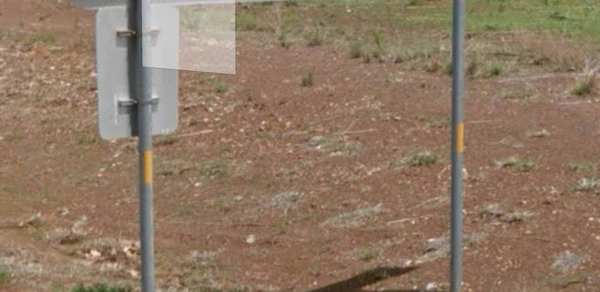{.img-size}

## Tasmania (TAS)

- Olive green possum guard.
- White background road markers.
  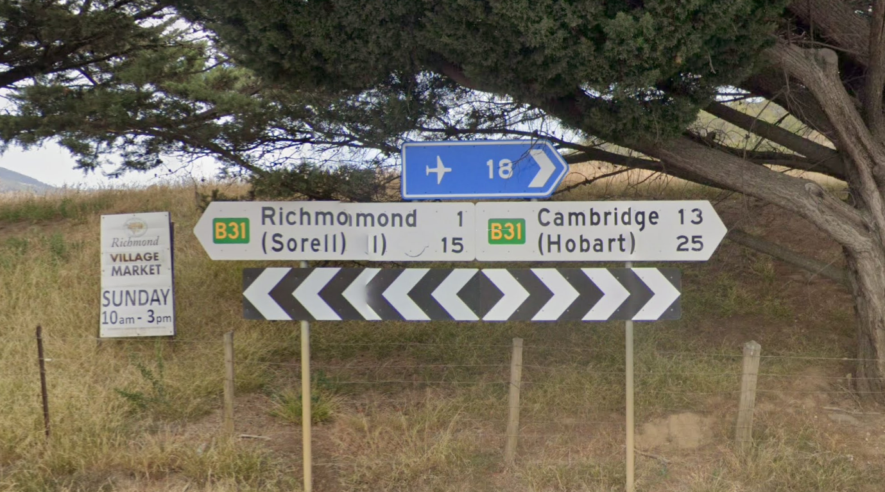{.img-size}
- Much more temperate looking landscape with light green rolling hills

## South Australia (SA)

- Stobie poles consisting of two steel beams sandwiching a slab of concrete
- This weird poletop
  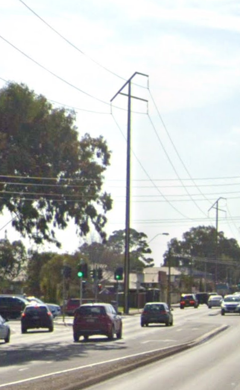{.img-size}
- Around Mount Gambier, you can see white soil and large pine tree plantations
  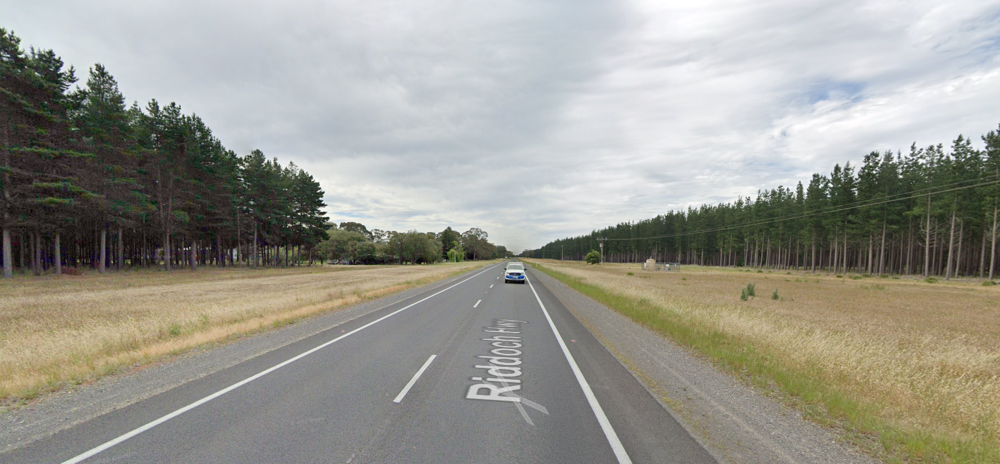{.img-size}

## Canberra (ACT)

- Canberra was originally [a planned city](https://en.wikipedia.org/wiki/Canberra#Urban_structure), so the city centre features a lot of low-rises. The city looks a lot more open - the buildings in the city centre look like they're used for government offices, and suburban outskirts. I dont have enough deterministic hits for ACT, once you've looked at enough planned cities (i.e. Brasilia, Astana - Kazakhstan) you can just tell. 

## Western Australia (WA)

- Black and white zebra bollard
  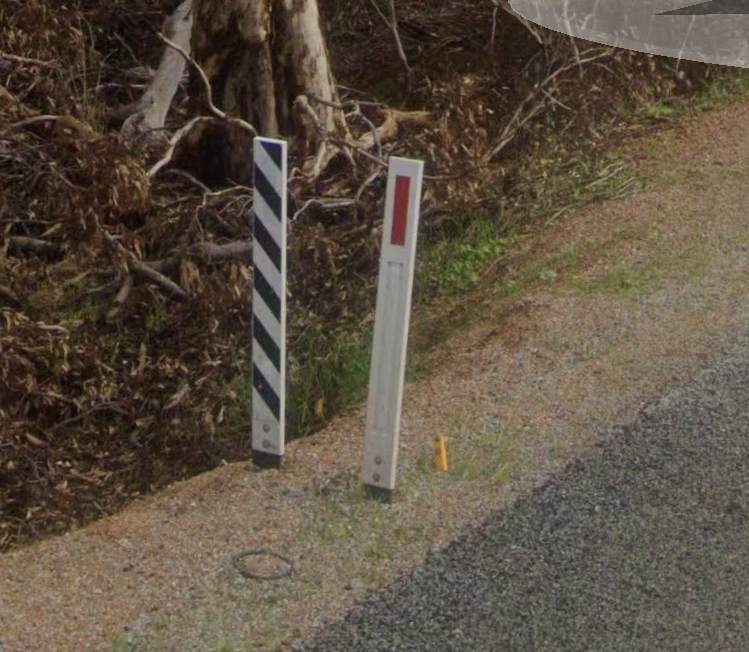{.img-size}
- Yellow sign post
  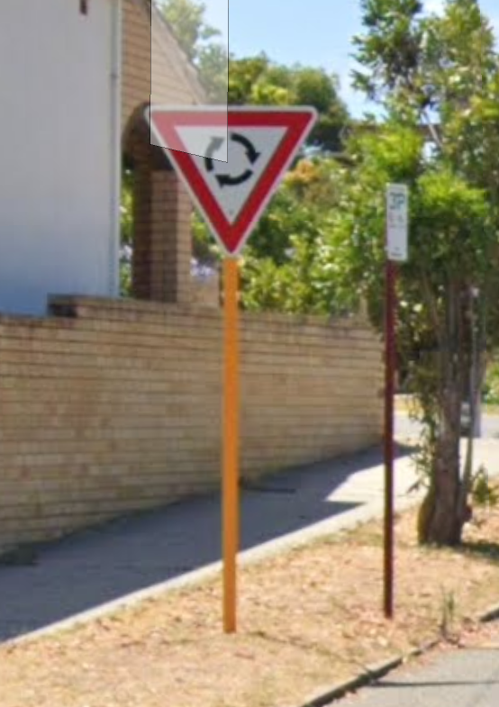{.img-size}
- Utility poles have green painted bottom and metal protector or attachment
  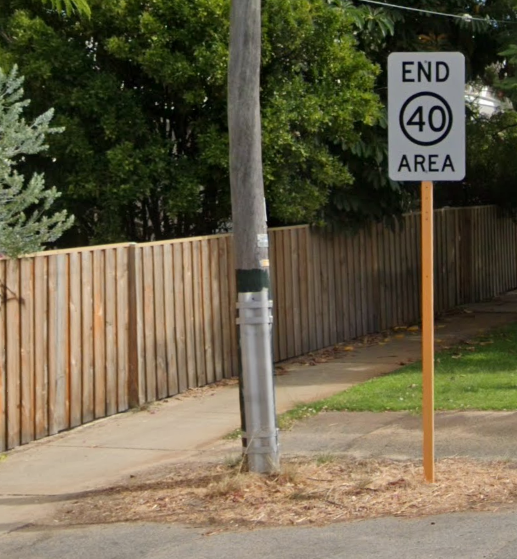{.img-size}