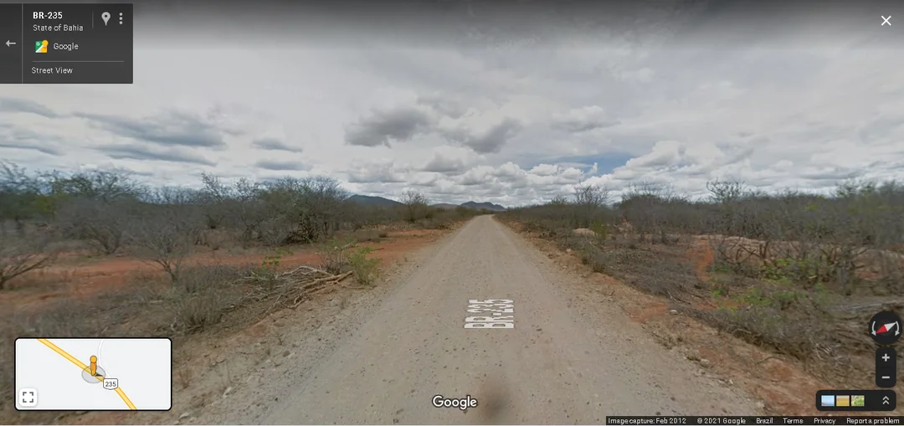
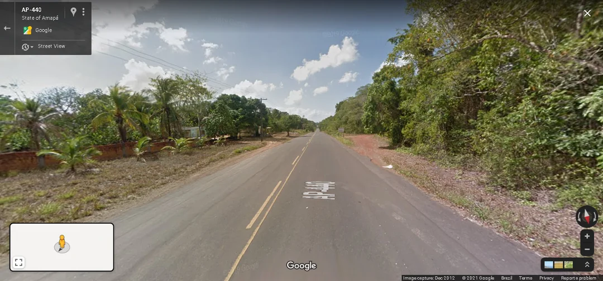
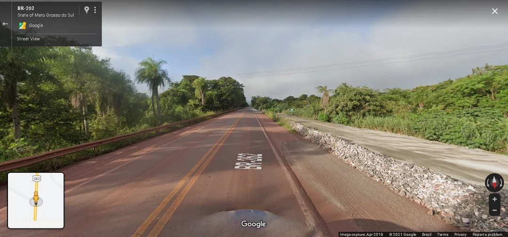
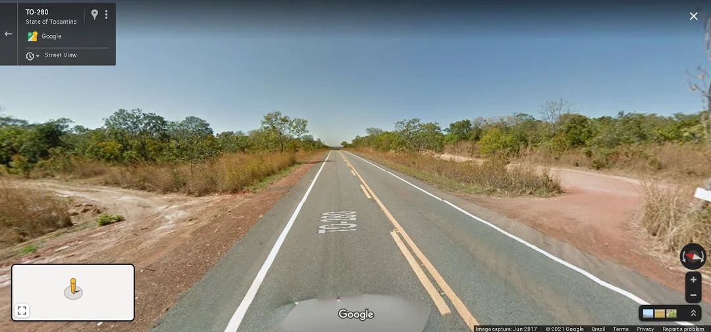
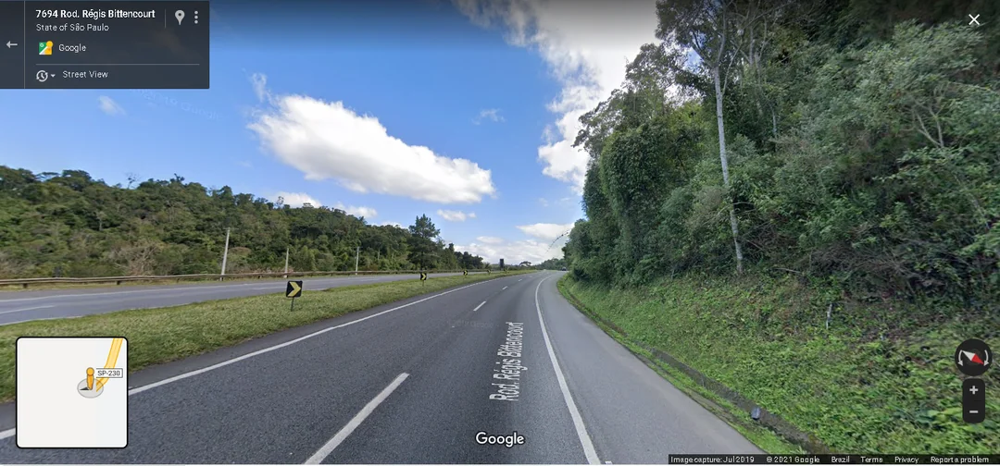
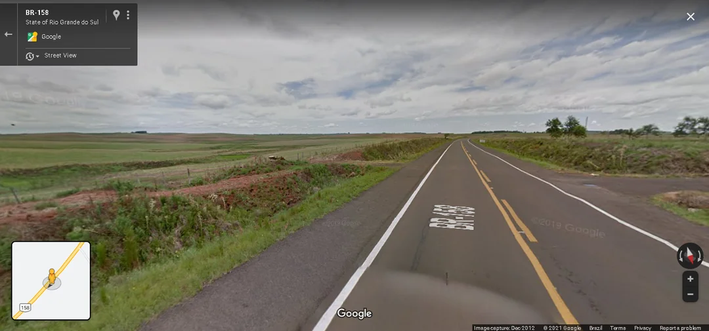
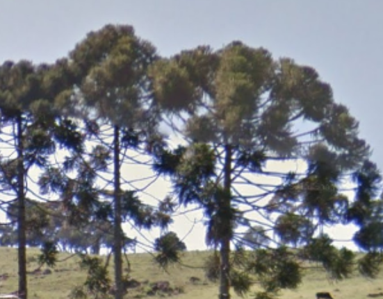

# Brazil

Brazil is #2 on the [GeoTime distribution list](https://docs.google.com/spreadsheets/d/1dfIb3u_B8c2azqx2yiRLxzWhcxHZ1iJcBxP-aaaQCXk/edit?gid=1288120995#gid=1288120995). There's a 1 in 10 chance that your next round would be in Brazil. The country is very learnable with lots of helpful clues.

## Phone codes

- Phone codes are very common to see and in my opinion are the highest ROI clue you can learn for this country. A rough explanation:
  - `1`: Sao Paulo state
  - `2`: Coastal area around Rio de Janeiro
  - `3`: Minas Gerais
  - `4`: Parana
  - `5`: Southern tip
  - `6`: Central and south west and Acre
  - `7`: Central eastern coast
  - `8`: Eastern tip, around Fortaleza
  - `9`: Northern and Amazon regions

## Area codes

- Each state in Brazil has a 2-letter code as an identifier, similar to the U.S. They are seen frequently on state roads/highways, as well as on some addresses. For example, `SC-110` means "route 110 in Santa Catarina". It's helpful to learn them, but Google Maps shows the area codes on the maps anyways

## Biomes

{.img-size}. Thanks to [u/Vatticcann](https://www.reddit.com/r/geoguessr/comments/p8spdw/brazil_biomes/) for compiling this. I'd say this is up next to phone codes in terms of ROI

- Northeast: dry, almost no trees, slightly blue/grey vegetation
  {.img-size}
- Northwest: tropical, green forests. Brazil coverage is east heavy so it's unlikely you'd get this
  {.img-size}
- Southwest - Mato Grosso do Sul: very lush vegetation, red soil, tall trees
  {.img-size}
- Central - north north-east: Not too dry, almost no trees and high bushes
  {.img-size}
- Eastern Atlantic Coast: green, tall forest. Looks a lot more temperate
  {.img-size}
- Southern tip: a lot of farms, flag, low grass, much redder soil
  {.img-size}

## Unique trees that I can remember

- Parana pines are unique to southern Brazil (Santa Catarina, Rio Grande do Sul, and Parana). They appear frequently enough that it's worth learning these.
  {.img-size}
- Sugarcane farms are most common in Sao Paulo state
